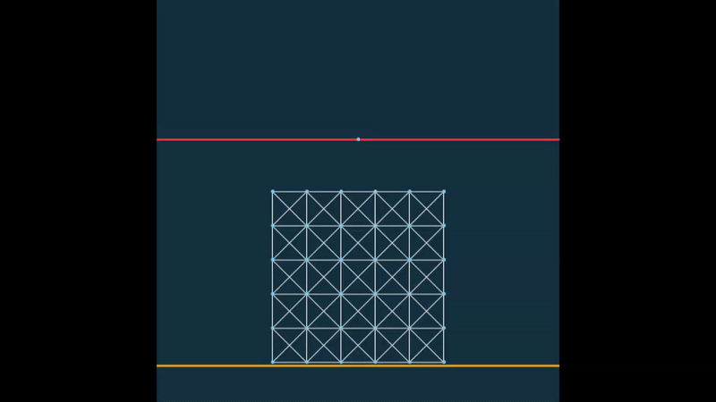

## Demo


## Moving Dirichlet Boundary Conditions

We aim to enforce the Dirichlet constraint

```math
A^{n+1} x = b^{n+1}
```

at each timestep. However, hard assignment of positions can lead to inversion or penetration in the optimization.

To solve this problem, we introduce a penalty term which softly enforces the constraint and allows it to be handled within the optimization framework.

### Energy 
```math
P_m^{n+1}(x) = \frac{\kappa_M}{2} \|A^{n+1}x - b^{n+1}\|_W^2
```
where $\kappa_M$ is the penalty stiffness and $W$ is a weighting matrix.

### Gradient
```math
\nabla P_m^{n+1}(x) = \kappa_M (A^{n+1})^T W (A^{n+1}x - b^{n+1})
```

### Hessian 
```math
\nabla^2 P_m^{n+1}(x) = \kappa_M (A^{n+1})^T W A^{n+1}
```


## Update stiffness parameter
The system is then solved using iterative Newton updates. During the solve, we monitor both: the optimization residual (gradient norm), and the constraint satisfaction.

If the optimization has converged (i.e., the residual is below tolerance), but the constraint is still not satisfied, this indicates that the penalty stiffness is insufficient. In this case, we increase the stiffness adaptively:

```math
\kappa_M \leftarrow 2 \kappa_M
```

and continue the optimization.

This process is repeated until both the optimization converges and the constraints are satisfied.